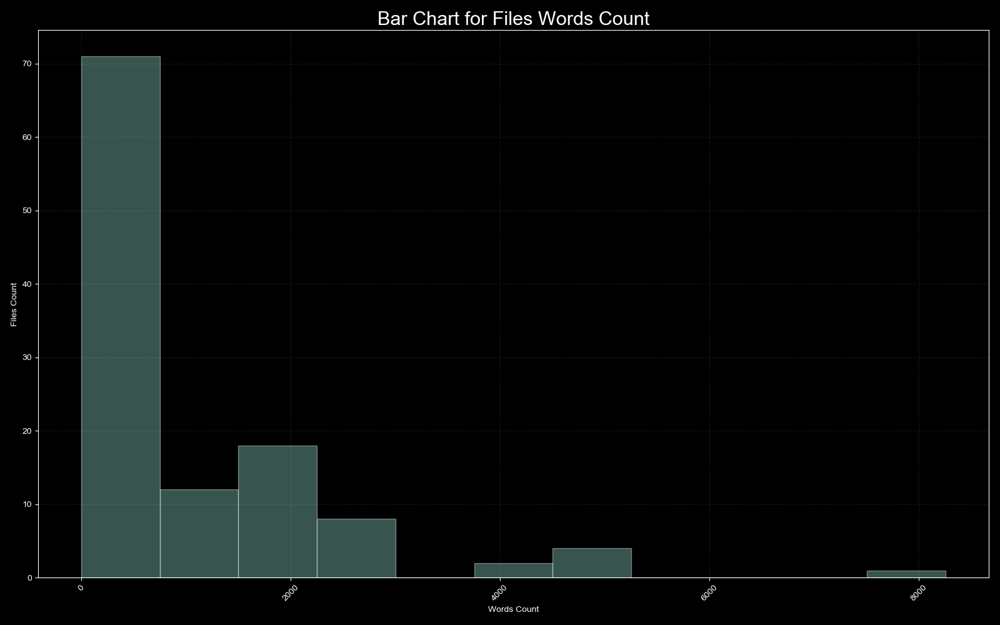

# Compatibility #
Histogramer has tested using `python 3.6.8` virtual environment in:
   * Windows 10 OS
   * macOS Catalina

# Description #
This tool analyze text files in a directory (which was specified by user) 
and it's sub folders. Statistics by words count is gathering 
for each text file was found. Then a histogram will be building 
by this statistics.
 
 # Example #

# Installation #
* #### Using a `*.whl` dist: ####
   * Download the latest `*.whl` version from a
   [releases page](https://github.com/pkomissarov91/histogramer/releases)
   * Install histogramer: `pip3 install --upgrade path_to_wheel.whl`

* #### Using sources: ####
   * Remove dist files from a project root:
      * Windows: `RMDIR /Q/S build dist histogramer.egg-info`
      * Mac: `rm -r build dist histogramer.egg-info`
   * Install wheel: `pip3 install wheel`
   * Build dist: `python setup.py bdist_wheel`
   * Install histogramer: `pip3 install --upgrade path_to_wheel.whl`

# Issues #
Please, report about any issues to an 
[issues page](https://github.com/pkomissarov91/histogramer/issues/new/choose)
with `~/.logs` folder's files attached.

# Usage #
Run a `python -m histogramer --help` script.
